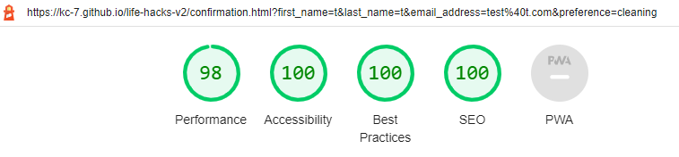

# Life Hax Website

Link to home page <a href="https://kc-7.github.io/life-hacks-v2/index.html" target="_blank" rel="noopener" aria-label="Link to the Life Hax Home Page (opens in new tab)">here</a> or click on the header above. 

## Design

This website is for an online life hacks company called Life Hax. Life Hax are currently offering free sign up to new members. Membership gives you access to their mailing list and mobile app. All users will receive access to content designed to save them time and money. This site is mainly targeted at male and female users between the ages of 18 and 65 years old. Once the website has built up a user base, they will add advertisements to generate site revenue. Existing members will remain ad free however new members who do not wish to see ads will need to sign up for a paid membership. The site will aim to provide tailored content for users in future based on their interests as the site grows. 

The site is intending to attract B2C customers and has been designed in a simple and unique manner that encourages the user to sign up. The website is easy to navigate by using a nav bar and floating top of screen button alongside the links and buttons within the website. The colours and styling were applied in a consitent manner to the site so that is visualy appealing and uniform. Potential customers in our target audience where interviewed during the planning stages to find out information on what would make a good experience and encourage them to sign up. Competiting sites were reviewed to find out what works and what can be improved on. 

Features to implement on the site were reviewed by ranking their importance against their feasibility to implement, this allowed me to focus on what would be most important for the end user and the success of the site. I also made some preliminary site mockup drawings in advance of developing. I got inspiration on colours by checking out sites such as <a href="https://www.canva.com/colors/" target="_blank" rel="noopener" aria-label="Link to the Canva's colour page (opens in new tab)">Canva</a>.

## Features

----

### Navigation

- The nav bar is located at the top of the screen and shows the site logo on the left hand side and the nav menu on the right hand side. 

- The nav menu includes 4 links which navigate to different sections of the main page. The links in the nav bar on the home page send the user directly to the section id to avoid reloading the page. The links on the confirmation page send you back to the main page. 

- The nav bar menu has responsive styling to work on devices with screen widths as low as 280px. Media queries have been added so that the menu appears aesthetically pleasing on a variety of different screen sizes. On larger screens, it shows all 4 items on 1 row. On smaller devices, such as mobile phones, the menu is displayed in 2 rows with 2 links on each row. 

- The home page has a link button at the bottom of the screen to send you back to the top of the page, this feature was not required on the confirmation page. 

- The nav bar has a decorative border around the items when the user hovers over it. The styling is in line with the rest of the website. 

### Hero Image Section

- The Hero Cover Image is displayed at the top of the page. An image with a transparent background was chosen and a visual animation effect was also added.

- Cover text is displayed in front of the image. The cover text includes the company slogan "Life Changing, Life Hax". The first line is a heading and then the company name "Life Hax" is displayed below it. There is a button that links the user to go straight to the sign up section to encourage them to join straight away with as little time spent scrolling to the section as possible.  

- The CSS Validation logo has been included in this section with an active link for anyone who is interested in verifying the site's code. The opacity has been reduced as this is not intended to be the focal point of the section.

### Life Hack Examples Section

- The Life Hack Examples section includes 3 divs to highlight life hacks, three topics where chosen with examples listed below each heading. 

- A picture is included in each div. It is styled to be displayed in a circular border. 

- The sections is divided into 3 divs which are displayed on a single row on larger screen widths and 1 div per row on smaller screen widths. 

- The div is styled with a decorative border, background colour etc. that is in line with the styling of the site. 

### Why Join Section

- The why join section is divided into 4 divs and includes content on why the user should join. It also includes another semi-subtle link to send the user to the sign up section. The site objective is to sign up as many users as possible.

- All 4 divs are displayed in one row on large screens, 2 divs per row on medium screens and 1 div per row on small screens.

- The div is styled with a decorative border, background colur etc. that is in line with the styling of the site. 

### Membership Section

- The membership section includes 2 headings and 2 videos. The sections are displayed on 1 row on larger devices and 1 section per row on smaller devices.

- The div is styled with a decorative border, background colour etc. that is in line with the styling of the site. 

### Sign Up Section

- The sign up section includes a form with text input areas for first name, last name, email address and password with each type set correctly. There is a question with 7 radio options, first 6 are individual options while the last option is for all so is displayed on the row below regardless of the device's screen width. The last part of the form is the submit button which is styled to entice the user to click the big red button when hovered over. The form will not allow the user to submit their data unless the required information has been provided. 

- The form is styled to be in line with the site styling however all 4 corners are rounded which is intentionally different than the above sections. This is similar to the hero cover text and the confirmation text. 

- The text input area is styled to adjust in size on smaller devices.

- The radio answers are designed to be distirbuted evenly onto multiple rows on smaller devices. 

### Confirmation Page

- When the form is submitted correctly, it will take the user to the sign up confirmation page. This page is not accessible via the nav links. This page is included so that the user knows that their data has been submitted correctly. 

- The confirmation page is styled similarly to the main page so the experience is pleasant for the site users. 

- The confirmation page includes a nav bar, footer, buttons and background image that are all similar to the main home page. 

### Social & App Section

- The footer contains 2 divs which provide links for social media and app stores. The divs are displayed in 1 row on larger devices and 1 div per row on smaller devices. 

- The colours are inversed from the above sections, this is visually appealing and provides a clear distinction between the footer and above sections. 

### Favicon

- The Favicon, the picture in the browser tab (learned from using <a href="https://www.w3schools.com/html/html_favicon.asp" target="_blank" rel="noopener" aria-label="Link to W3Schools' Favicon Guide (opens in new tab)">W3Schools</a>' guide on implemeting this feature).

## Technologies
----

The following technologies were used on this site: 

- **HTML** - is used to design the website. 

- **CSS** - is used to stlye the website. 

- **Google Fonts** - is used to import additional fonts. 

- **Font Awesome V5 Icons** - is used to import icons. 

- **GitPod** - is the platform used to develop the site. 

- **GitHub** - is used to host the website. 

## Testing
----

### Initial Testing

- The initial tests were carried out by utilising the inspect feature on the Google Chrome web browser on my laptop. I also checked how the website responded on my mobile phone. I ran initial (W3C) validation tests for both the HTML and CSS alongside Lighthouse Reports on Chrome. I addressed and resolved any of the issues that arose. 

### Test Cases to ensure site performs as intended

- All links in the nav bar were checked to ensure they direct you to the correct location and that the smooth scroll effect is working. The hover feature was checked to ensure the custom border is displayed correctly. 

- The Top of Page button was checked to ensure it directs you back to the top of the page smoothly. 

- The page was reloaded to check that the hero image zoom animation is working. 

- The sign up link in the hero image cover text was checked to ensure it directs the user to the correct location smoothly.

- The W3C logo was checked to ensure it is displayed in the correct location, opens in a new tab and provides no errors on the validation page. 

- The Life Hacks section was checked to ensure that the styling, hover features, icons and images are all working as intended. 

- The Why Join section was checked to ensure that the styling, hover features, icons, link to sign up and images are all working as intended. 

- The Membership section was tested to ensure that the divs are styled correctly, icons are working, videos displayed correctly, playing automaticaly, in a continuous loop and in good quality.

- The Sign Up section was checked to ensure the following: 
    - The form is displayed with the correct syling. 
    - Both the first and last name are required and show in the input as standard test. 
    - The email address field is required and set correctly (i.e. required input requires an @ and .)
    - The password section is required and hides the entered text. 
    - The what are you most interest in question is displayed correctly and one answer is required. 
    - The all of the above radio answer is displayed below the first 6 options. 
    - The Sign Up button is displayed in the correct style and that the hover feature is working. It must take the user to the confirmation page when the required data on form as been completed by the user. 

- The Footer section was tested to ensure all links are working, open in seperate page, and that the styling is set correctly for the different background colour, icons and text.

- The Confirmation page was tested to ensure the following: 
    - The content is displayed in front of the hero image.
    - The styling of the text, background and borders is working. 
    - The Return to Home Page button is working. 
    - The nav menu and footer links are working correctly. 

### Bugs & Solved Issues

- My images and videos were not working when the site was deployed at first as I had used a "/" in front of the file locations. 

- Initially, I uploaded higher quality photos and videos. To improve page performance, as recommended on the lighthouse report, I reduced the file sizes accordingly so that they are an optimal size and format (.webp & .mp4) for the site. I also experimented by adding the videos to the site by embedding a YouTube video using iframes but chose not to go ahead with this.  

- Initially, I had 6 nav bar links and designed for the nav bar menu items to be stacked vertically on smaller devices. This meant the clickable area on mobile devices would have been on the small side and potentially be considered as a bug or design flaw. To improve on this, I removed the link to the Social & app links in the footer and moved the "Top of Page" link into a button that is displayed at the bottom right hand side of the site instead. I then restyled the responsive design for the menu nav bar so that it goes from 4 items in 1 row to 2 items spread over 2 rows for smaller devices. **Previous nav bar shown below.**

- At first, I created a circular div with a link inside of it that was displayed in the hero text. I consider this as a bug as it gave the impression that by clicking anywhere inside the circle would activate the link but the user actually had to click on the text to follow the link. To rectify this issue, I implemented a button enclosed in a form that sends the user to the desired location. I then implemented this button type on the confirmation page as well. 

- When I set up the confirmation page, I copied the nav bar over from the home page. I discovered during initial testing that the links were not working. The links on the home page nav bar were set to send the user directly to the section of the page without refreshing so did not include the full URL, only the section path. I updated the links on the confirmation page nav bar so they would work. 

- I was provided with a CSS validator link once the website passed the checks. Initially, this link would not work, I resolved this by using the alternative link they provided. I also removed the trailing slash and hosted the image on GitHub instead of linking to an external resource. I also added a no opener, alt, styling etc. 

#### W3C HTML Validator

- No issues found in final tests on both the main and confirmation pages.

<a href="https://validator.w3.org/nu/?doc=https%3A%2F%2Fkc-7.github.io%2Flife-hacks-v2%2Findex.html" target="_blank" rel="noopener" aria-label="Link to the HTML Validator for Home Page (opens in new tab)">Home Page HTML</a> Validation:

<a href="https://validator.w3.org/nu/?doc=https%3A%2F%2Fkc-7.github.io%2Flife-hacks-v2%2Fconfirmation.html" target="_blank" rel="noopener" aria-label="Link to the HTML Validator for Confirmation Page (opens in new tab)">Confirmation Page HTML</a> Validation:

#### W3C CSS Validator

- No issues found in final tests on both the main and confirmation pages. CSS Validator logos with links have been added to both pages. 

Home Page:

Confirmation Page: 

#### Lighthouse - Performance, Accessibility, Best Practices & SEO

- Performance: 98%
- Accessibility: 100%
- Best Practices: 100%
- SEO: 100%

Same results for both the main and confirmation page. The performance score can vary, above results achieved while using chrome in incognito mode to disable browser extensions. Time was spent on improving all scores by addressing the highlighted opportunities. 

#### Visual Testing

- Visual testing was mainly carried out using the Google Chrome Inspect function. I tested all sections of the site on a combination of different screen sizes. 

- Visual testing was also carried out using <a href="https://ui.dev/amiresponsive" target="_blank" rel="noopener" aria-label="Link to Am I Responsive Website (opens in new tab)">Am I Responsive</a>. The resposive images above were taken from this website. The site provides simulations in the following sizes: 
    - Desktop: 1600 x 992 px - scaled down to scale (0.3181)
    - Laptop: 1280 x 802 px - scaled down to scale (0.277)
    - Tablet: 768 x 1024 px - scaled down to scale (0.219)
    - Mobile: 320 x 480 px - scaled down to scale (0.219)

- I carried out visual testing on the following device sizes using Google Inspect: 
    - iPhone SE: 375 x 667 px
    - iPhone XR: 414 x 896 px
    - iPhone 12 Pro 390 x 844 px
    - Pixel 5: 393 x 851 px
    - Samsung Galaxy S8+: 360 x 740 px
    - Samsung Galaxy S20 Ultra: 412 x 915 px
    - iPad Air: 820 x 1180 px
    - iPad Mini: 768 x 1024 px
    - Surface Pro 7: 912 x 1368 px
    - Galaxy Fold: 280 x 653 px - *Note, this is the smallest device size the site has been designed to operate on*
    - Nest Hub: 1024 x 600 px
    - Nest Hub Max: 1280 x 800 px

- I physically tested the site on the following devices: 
    - Dell Monitor - 24": 1920 x 1200 px
    - Lenovo Yoga 910 - 14" (4k): 3840 x 2160 px
    - Samsung Galaxy S10 - 5.8": 360 x 760 px

### Unresolved Bugs & Future Improvements 

#### Unresolved Bugs

- All bugs that I am aware of have been addressed and resolved. 

#### Future Improvements 

- Add <a href="https://www.w3schools.com/howto/howto_js_scroll_to_top.asp" target="_blank" rel="noopener" aria-label="Link to my W3Schools guide to add Top Button (opens in new tab)">JavaScript</a> to remove the "Top of Page" link button when the user is already at the top of the page. 

- Implement a <a href="https://www.w3schools.com/howto/howto_js_topnav_responsive.asp" target="_blank" rel="noopener" aria-label="Link to my W3Schools guide to responsive nav menu (opens in new tab)">responsive nav menu</a> with a "hamburger" styled menu for use on smaller devices, especially useful if additional sections are added to the site in future. 

- Consider relocating the cover text over the hero text on the home page to the right hand side of the screen so the sign up link is closer to the users thumb on mobile devices if right handed. This will only work once the Top of Page Button has been removed when the user is at the top of the page or it would interfer with the content - see above point. 

- Currently the sign up form does not send any data or create an account for user, this will need to be set up in future. 

- Implement a Page Not Found Page with custom design in line with the rest of the site.

- Develop application for site and share via the Google and Apple App Stores. Updated links in footer. 

- Create social media pages for the site and update links in footer. 

- Create contact email address for the site, use a custom web domain etc. 

- Add additional life hack examples with additional images and custom videos to draw in more potential users. 

- Carry out additional user feedback interviews and review any issues or recommendations that are highlighted accordingly. 

## Deployment
----

### GitPod

- I developed the site using HTML and CSS in GitPod. 

- I ran a local sever each time I was viewing & editing it by typing the below into the terminal: 
    - *python3 -m http.server*

- For version control, I regularly updated my work to GitHub by entering the below commands into the terminal: 
    - *git add .*
    - *git commit -m "Update message  here"*
    - *git push*

### GitHub

- The site was deployed to <a href="https://github.com/KC-7/life-hacks-v2" target="_blank" rel="noopener" aria-label="Link to my GitHub Repo (opens in new tab)">GitHub</a> pages. This was achieved by navigating to settings from the GitHub Repository, selecting GitHub Pages, changing the source to main branch, saving and then publishing. 

- My username on GitHub is <a href="https://github.com/KC-7/" target="_blank" rel="noopener" aria-label="Link to my GitHub account (opens in new tab)">KC-7</a>.

- URL Links to the site below: 
    - Home Page: https://kc-7.github.io/life-hacks-v2/index.html
    - Confirmation Page: https://kc-7.github.io/life-hacks-v2/confirmation.html

## Credits
----

### Content

- This site was developed using information learned from the <a href="https://codeinstitute.net/" target="_blank" rel="noopener" aria-label="Link to the Code Institute (opens in new tab)">Code Institute</a> alongside other online resources such as <a href="https://www.w3schools.com/html/html_favicon.asp" target="_blank" rel="noopener" aria-label="Link to W3Schools (opens in new tab)">W3Schools</a>. 

- The Code Institute Gitpod Full Template was used as the basis for the project. The repo is available on their <a href="https://github.com/Code-Institute-Org/gitpod-full-template" target="_blank" rel="noopener" aria-label="Link to The Code Institute Gitpod Full Template (opens in new tab)">GitHub Account here</a>. 

- The code used to animate the hero page was learned from the <a href="https://codeinstitute.net/" target="_blank" rel="noopener" aria-label="Link to the Code Institute (opens in new tab)">Code Institute's</a> Love Running Project although the values are different to suit the Life Hax website. 

- I learned how to implement the Favicon, the picture in the browser tab, from using <a href="https://www.w3schools.com/html/html_favicon.asp" target="_blank" rel="noopener" aria-label="Link to W3Schools' Favicon Guide (opens in new tab)">W3Schools</a> guide on implemeting this feature.

- I learned how to implement the smooth scroll function, the effect that scrolls down to the area being navigated to instead of jumping to it, from using <a href="https://www.w3schools.com/howto/howto_css_smooth_scroll.asp" target="_blank" rel="noopener" aria-label="Link to W3Schools' Smooth Scroll Guide (opens in new tab)">W3Schools</a> guide on implementing this feature.

- The social links, app download sections and the CSS validator logo all contain links to third party websites. 

- Font added using <a href="https://fonts.google.com/" target="_blank" rel="noopener" aria-label="Link to Google Fonts (opens in new tab)">Google Fonts</a>.

- Icons added using <a href="https://fonts.google.com/" target="_blank" rel="noopener" aria-label="Link to Font Awesome | Free V5 Icons (opens in new tab)">Font Awesome | Free V5 Icons</a>.

- The resposive images in the README file above were taken from <a href="https://ui.dev/amiresponsive" target="_blank" rel="noopener" aria-label="Link to Am I Responsive Website (opens in new tab)">Am I Responsive</a>.

### Media

- Both of the videos on the homepage were sourced from <a href="https://www.rawpixel.com/public-domain" target="_blank" rel="noopener" aria-label="Link to Pexel's Home Page (opens in new tab)">Pexel</a> and are both are available for use in the Public Domain. Both video give credit to the content uploader in the index.html file. 

- All of the images were sourced from <a href="https://www.rawpixel.com/public-domain" target="_blank" rel="noopener" aria-label="Link to RawPixel's Public Domain Content (opens in new tab)">RawPixel</a> and are available for use in the Public Domain.

- The custom site logo was created using <a href="https://www.shopify.com/tools/logo-maker" target="_blank" rel="noopener" aria-label="Link to Shopify's Logo Maker (opens in new tab)">Shopify's Free Logo Maker</a>.

- The CSS image was provided by the <a href="http://jigsaw.w3.org/css-validator/validator?lang=en&profile=css3svg&uri=https%3A%2F%2Fkc-7.github.io%2Flife-hacks-v2%2Findex.html&usermedium=all&vextwarning=&warning=1" target="_blank" rel="noopener" aria-label="Link to CSS Validator for Home Page (opens in new tab)">W3 Jigsaw Validator</a> once all checks were passed.

- The video size was reduced using <a href="https://www.freeconvert.com/video-compressor" target="_blank" rel="noopener" aria-label="Link to Free Convert's Video Compessor (opens in new tab)">Free Convert's Video Compessor</a>.

- The images were converted to webp format using <a href="https://convertio.co/webp-converter/" target="_blank" rel="noopener" aria-label="Link to Convertio's WEBP Converter (opens in new tab)">Convertio's WEBP Converter</a>.

- The images were resized using <a href="https://www.adobe.com/express/feature/image/resize" target="_blank" rel="noopener" aria-label="Link to Adobe's Online Image Resizer (opens in new tab)">Adobe's Online Image Resizer </a>.

- I got inspiration on colours by checking out sites such as <a href="https://www.canva.com/colors/" target="_blank" rel="noopener" aria-label="Link to the Canva's colour page (opens in new tab)">Canva</a>.

